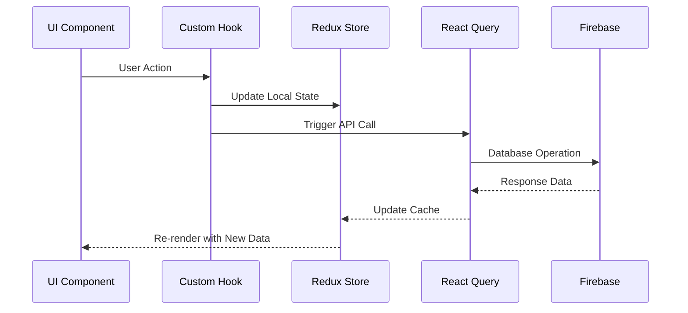

# Technical Architecture

This document provides a comprehensive overview of the FitMatch application's technical architecture, including system design, technology choices, data flow, and infrastructure.

## 🏗 System Architecture Overview

FitMatch follows a modern **Client-Server Architecture** with **Firebase Backend-as-a-Service** providing the complete server infrastructure. The application implements **Redux + React Query** for state management and **React Native + Expo** for cross-platform mobile development.

```
┌─────────────────────────────────────────────────────────────┐
│                    FitMatch Architecture                     │
├─────────────────────────────────────────────────────────────┤
│                                                             │
│  ┌─────────────┐    ┌─────────────┐    ┌─────────────┐      │
│  │     iOS     │    │   Android   │    │     Web     │      │
│  │    App      │    │     App     │    │     App     │      │
│  └─────────────┘    └─────────────┘    └─────────────┘      │
│           │                   │                   │         │
│           └───────────────────┼───────────────────┘         │
│                               │                             │
│  ┌─────────────────────────────────────────────────────────┐ │
│  │              React Native Layer                         │ │
│  │  ┌─────────────┐  ┌─────────────┐  ┌─────────────┐     │ │
│  │  │   UI/UX     │  │   Business  │  │    State    │     │ │
│  │  │ Components  │  │    Logic    │  │ Management  │     │ │
│  │  └─────────────┘  └─────────────┘  └─────────────┘     │ │
│  └─────────────────────────────────────────────────────────┘ │
│                               │                             │
│  ┌─────────────────────────────────────────────────────────┐ │
│  │                Firebase Services                        │ │
│  │  ┌─────────────┐  ┌─────────────┐  ┌─────────────┐     │ │
│  │  │ Authentication │  │  Firestore  │  │   Storage   │     │ │
│  │  │              │  │  Database   │  │             │     │ │
│  │  └─────────────┘  └─────────────┘  └─────────────┘     │ │
│  └─────────────────────────────────────────────────────────┘ │
└─────────────────────────────────────────────────────────────┘
```

## 📱 Frontend Architecture

### React Native + Expo Framework

**Core Technologies:**
- **React Native 0.79.5**: Cross-platform mobile framework
- **Expo 53.0.20**: Development platform and build tools
- **TypeScript**: Complete type safety implementation
- **React Navigation**: Screen navigation and routing

### Component Architecture

```
app/
├── (root)/                 # Main app screens (tab navigation)
│   ├── Home/              # Social feed and posts
│   ├── MessageScreen/     # Chat and messaging
│   ├── Profile/           # User profile management
│   └── Events/            # Event management
├── Auth/                  # Authentication screens
├── Users/                 # User management screens
├── Partner/               # Partner/brand screens
└── _layout.tsx           # Root layout with providers

components/
├── shared/               # Reusable UI components
│   ├── ErrorBoundary.tsx # Error handling
│   ├── Button.tsx        # Custom buttons
│   └── Input.tsx         # Form inputs
├── Posts/                # Social media components
│   ├── PostCard.tsx      # Individual post display
│   ├── PostForm.tsx      # Post creation
│   └── CommentList.tsx   # Comments system
└── Stories/              # Stories feature components
    ├── StoryViewer.tsx   # Story viewing
    └── StoryCreator.tsx  # Story creation
```

### State Management Architecture

#### Redux Toolkit Implementation

```typescript
// store/store.ts
export const store = configureStore({
  reducer: rootReducer,
  middleware: (getDefaultMiddleware) =>
    getDefaultMiddleware({
      serializableCheck: {
        ignoredActions: [FLUSH, REHYDRATE, PAUSE, PERSIST, PURGE, REGISTER],
      },
    }),
});

// Type definitions
export type RootState = ReturnType<typeof store.getState>;
export type AppDispatch = typeof store.dispatch;
```

#### State Slices Organization

```typescript
// store/rootReducer.ts
const rootReducer = combineReducers({
  auth: authSlice,       // Authentication state
  user: userSlice,       // User data and preferences
  partner: partnerSlice, // Partner/brand data
  // Additional slices as needed
});
```

**State Persistence:**
```typescript
// Redux Persist configuration
const persistConfig = {
  key: 'root',
  storage: AsyncStorage,
  whitelist: ['auth', 'user'], // Persist specific slices
};
```

#### React Query Integration

```typescript
// Server state management
const queryClient = new QueryClient({
  defaultOptions: {
    queries: {
      staleTime: 5 * 60 * 1000, // 5 minutes
      gcTime: 10 * 60 * 1000,   // 10 minutes
      retry: 3,
      retryDelay: attemptIndex => Math.min(1000 * 2 ** attemptIndex, 30000),
    },
  },
});
```

### Custom Hooks Architecture

**Separation of Concerns:**
```typescript
customHooks/
├── useAuth.ts             # Authentication logic
├── useUserManagement.ts   # User CRUD operations
├── useGoogleSignIn.ts     # Google authentication
├── useEmailAuth.ts        # Email authentication
├── useUserList.ts         # User list management
├── useIsKeyboardVisible.ts # UI state management
└── useUserActive.ts       # Activity tracking
```

**Example Custom Hook:**
```typescript
// customHooks/useEmailAuth.ts
export const useEmailAuth = () => {
  const dispatch = useAppDispatch();
  
  const signIn = async (email: string, password: string) => {
    try {
      const userCredential = await signInWithEmailAndPassword(auth, email, password);
      dispatch(setUser(userCredential.user));
      return { success: true };
    } catch (error) {
      return { success: false, error: error.message };
    }
  };

  return { signIn, signUp, resetPassword };
};
```

## 🗄 Backend Architecture (Firebase)

### Firebase Services Integration

#### Authentication Service
```typescript
// config/firebaseConfig.ts
export const auth = getAuth(firebaseApp);

// Supported authentication methods:
// - Email/Password
// - Google Sign-In
// - Future: Apple Sign-In, Facebook, etc.
```

#### Firestore Database Schema

**Users Collection:**
```typescript
interface UserData {
  uid: string;
  email: string;
  name: string;
  age: number;
  fitnessGoals: string[];
  profilePicUrl?: string;
  coverPicUrl?: string;
  location: {
    latitude: number;
    longitude: number;
    address: string;
  };
  preferences: {
    ageRange: [number, number];
    distance: number;
    workoutTypes: string[];
  };
  createdAt: Timestamp;
  updatedAt: Timestamp;
  isActive: boolean;
  lastSeen: Timestamp;
}
```

**Partners Collection:**
```typescript
interface PartnerData {
  uid: string;
  email: string;
  titre: string;
  description: string;
  images: string[];
  videos: string[];
  category: string;
  website?: string;
  social: {
    instagram?: string;
    facebook?: string;
    youtube?: string;
  };
  location: LocationData;
  isVerified: boolean;
  createdAt: Timestamp;
}
```

**Posts Collection:**
```typescript
interface PostData {
  id: string;
  authorId: string;
  content: string;
  mediaUrls: string[];
  likes: {
    count: number;
    by: string[];
  };
  comments: CommentData[];
  createdAt: Timestamp;
  visibility: 'public' | 'followers' | 'private';
}
```

**Chats Collection:**
```typescript
interface ChatData {
  id: string;
  participants: string[]; // Array of user IDs
  lastMessage: {
    text: string;
    senderId: string;
    createdAt: Timestamp;
    read: boolean;
  };
  messages: {
    // Subcollection
    id: string;
    text: string;
    senderId: string;
    createdAt: Timestamp;
    read: boolean;
    mediaUrl?: string;
  }[];
}
```

#### Storage Service
```typescript
// Firebase Storage structure
storage/
├── users/
│   ├── {userId}/
│   │   ├── profile/       # Profile pictures
│   │   ├── cover/         # Cover photos
│   │   └── videoChallenge/ # Video challenges
├── partenaires/
│   ├── {partnerId}/
│   │   ├── images/        # Partner images
│   │   └── videos/        # Partner videos
└── posts/
    ├── {postId}/          # Post media files
    └── stories/           # Story media files
```

#### Detailed Data Schema

**Extended Users Collection Schema:**
```typescript
interface UserDocument {
  // Core Identity
  uid: string;
  email: string;
  nom: string;
  prenoms: string;
  pseudo?: string;
  
  // Profile
  profilePicUrl?: string;
  coverPhotoUrl?: string;
  bio?: string;
  dateNaissance: string;
  nationalite: string;
  
  // Fitness Profile
  fitnessGoals: string[];
  workoutTypes: string[];
  experienceLevel: "beginner" | "intermediate" | "advanced";
  preferredSchedule: {
    days: string[];
    timeSlots: string[];
  };
  
  // Location
  location: {
    address: string;
    latitude: number;
    longitude: number;
  };
  
  // Media
  images: string[];
  videos: string[];
  
  // App State
  isValid: boolean;
  acceptCGU: boolean;
  isVerified: boolean;
  
  // Timestamps
  createdAt: Timestamp;
  updatedAt: Timestamp;
  lastSeen: Timestamp;
}
```

**Posts Collection Schema:**
```typescript
interface PostDocument {
  id: string;
  
  // Content
  text: string;
  mediaUrl?: string;
  mediaType?: "photo" | "video";
  thumbnailUrl?: string; // For videos
  
  // Author Info (denormalized for performance)
  posterInfo: {
    uid: string;
    username: string;
    profilePicUrl?: string;
    verified?: boolean;
  };
  
  // Engagement Metrics
  likes: {
    count: number;
    by: string[]; // User IDs who liked
  };
  comments: {
    count: number;
  };
  shares: {
    count: number;
    by: string[];
  };
  
  // Tagging
  taggedUsers: string[];
  taggedEventId?: string;
  taggedPlaceName?: string;
  
  // Timestamps
  createdAt: Timestamp;
}
```

**Events Collection Schema:**
```typescript
interface EventDocument {
  id: string;
  title: string;
  description: string;
  
  // Event Details
  eventType: "workout" | "class" | "competition" | "social";
  category: string; // "cardio", "strength", "yoga", etc.
  
  // Scheduling
  startDate: Timestamp;
  endDate: Timestamp;
  duration: number; // minutes
  
  // Location
  location: {
    address: string;
    latitude: number;
    longitude: number;
    venue?: string;
  };
  
  // Organizer Info
  organizerInfo: {
    uid: string;
    name: string;
    profilePicUrl?: string;
    type: "user" | "partner";
  };
  
  // Participants
  participants: {
    current: string[]; // User IDs
    max?: number;
    waitlist: string[];
  };
  
  // Media
  images: string[];
  
  // Status
  status: "upcoming" | "ongoing" | "completed" | "cancelled";
  isPublic: boolean;
  
  // Timestamps
  createdAt: Timestamp;
  updatedAt: Timestamp;
}
```

**Stories Collection Schema:**
```typescript
interface StoryDocument {
  id: string;
  
  // Content
  mediaUrl: string;
  mediaType: "photo" | "video";
  
  // Author Info
  posterInfo: {
    uid: string;
    nom: string;
    prenoms: string;
    profilePicUrl: string;
  };
  
  // Expiration
  expiredOn: Timestamp; // Auto-delete after 24h
  
  // Timestamps
  createdAt: Timestamp;
}
```

**Enhanced Chat Schema:**
```typescript
interface ChatDocument {
  id: string;
  participants: {
    [userId: string]: {
      name: string;
      profilePicUrl?: string;
      joinedAt: Timestamp;
      lastSeen: Timestamp;
    };
  };
  
  // Chat Metadata
  type: "direct" | "group";
  title?: string; // For group chats
  
  // Last Message (denormalized for performance)
  lastMessage: {
    id: string;
    text: string;
    senderId: string;
    senderName: string;
    type: "text" | "image" | "video" | "location";
    createdAt: Timestamp;
    edited?: boolean;
  };
  
  // Chat State
  isActive: boolean;
  unreadCount: {
    [userId: string]: number;
  };
  
  // Timestamps
  createdAt: Timestamp;
  updatedAt: Timestamp;
}

// Messages subcollection: chats/{chatId}/messages/{messageId}
interface MessageDocument {
  id: string;
  text: string;
  senderId: string;
  senderName: string;
  
  // Message Type
  type: "text" | "image" | "video" | "location" | "system";
  
  // Media (if applicable)
  mediaUrl?: string;
  thumbnailUrl?: string;
  
  // Location (if applicable)
  location?: {
    latitude: number;
    longitude: number;
    address?: string;
  };
  
  // Message State
  edited?: boolean;
  editedAt?: Timestamp;
  readBy: {
    [userId: string]: Timestamp;
  };
  
  // Timestamps
  createdAt: Timestamp;
}
```

### Security Rules

**Firestore Security Rules:**
```javascript
rules_version = '2';
service cloud.firestore {
  match /databases/{database}/documents {
    // Users can read/write their own data
    match /users/{userId} {
      allow read, write: if request.auth != null && request.auth.uid == userId;
    }
    
    // Public read access for posts, authenticated write
    match /posts/{postId} {
      allow read: if true;
      allow write: if request.auth != null;
    }
    
    // Chat access for participants only
    match /chats/{chatId} {
      allow read, write: if request.auth != null && 
        request.auth.uid in resource.data.participants;
    }
  }
}
```

## 🎨 UI/UX Architecture

### Styling System (NativeWind)

**TailwindCSS Integration:**
```typescript
// tailwind.config.js
module.exports = {
  content: [
    './app/**/*.{js,jsx,ts,tsx}',
    './components/**/*.{js,jsx,ts,tsx}',
  ],
  presets: [require('nativewind/preset')],
  theme: {
    extend: {
      colors: {
        primary: '#FF6B6B',
        secondary: '#4ECDC4',
        accent: '#45B7D1',
      },
    },
  },
};
```

**Component Styling Pattern:**
```typescript
// Consistent styling approach
const PostCard = ({ post }: PostCardProps) => {
  return (
    <View className="bg-white rounded-lg shadow-md p-4 mb-4">
      <Text className="text-lg font-bold text-gray-800">
        {post.title}
      </Text>
      {/* More component content */}
    </View>
  );
};
```

### Navigation Architecture

**Expo Router Implementation:**
```typescript
// app/_layout.tsx
export default function RootLayout() {
  return (
    <Stack>
      <Stack.Screen name="(root)" options={{ headerShown: false }} />
      <Stack.Screen name="Auth" options={{ headerShown: false }} />
      <Stack.Screen name="Users" options={{ presentation: 'modal' }} />
    </Stack>
  );
}

// app/(root)/_layout.tsx - Tab Navigation
export default function TabLayout() {
  return (
    <Tabs>
      <Tabs.Screen name="Home" />
      <Tabs.Screen name="MessageScreen" />
      <Tabs.Screen name="Profile" />
    </Tabs>
  );
}
```

## 🔄 Data Flow Architecture

### Client-Server Data Flow



### State Management Flow

**Local State (Redux):**
- User authentication status
- User preferences and settings
- UI state (loading, errors)
- Cached user data

**Server State (React Query):**
- Posts and social content
- User lists and search results
- Chat messages
- Event data

**Example Data Flow:**
```typescript
// 1. User action in component
const handleLikePost = async (postId: string) => {
  // 2. Optimistic update in Redux
  dispatch(updatePostLike({ postId, liked: true }));
  
  // 3. Server update via React Query
  await likeMutation.mutateAsync(postId);
};

// 4. React Query automatically updates cache and triggers re-render
```

## 🔧 Build & Deployment Architecture

### Development Environment

**Expo Development Build:**
```json
{
  "expo": {
    "name": "FitMatch",
    "slug": "fitmatch",
    "scheme": "fitmatch",
    "platforms": ["ios", "android", "web"],
    "plugins": [
      "@react-native-firebase/app",
      "@react-native-google-signin/google-signin"
    ]
  }
}
```

### Build Process

**EAS Build Configuration:**
```json
{
  "build": {
    "development": {
      "developmentClient": true,
      "distribution": "internal"
    },
    "preview": {
      "distribution": "internal"
    },
    "production": {
      "autoIncrement": true
    }
  }
}
```

### Deployment Strategy

1. **Development**: Expo Go app for rapid iteration
2. **Staging**: Internal distribution builds for testing
3. **Production**: App Store and Google Play submissions

## 🔒 Security Architecture

### Authentication Flow
```typescript
// Multi-provider authentication
const authFlow = {
  email: () => signInWithEmailAndPassword(auth, email, password),
  google: () => GoogleSignin.signIn(),
  // Future providers...
};
```

### Data Security
- **Client-side**: TypeScript type checking, input validation
- **Server-side**: Firebase Security Rules, authentication required
- **Transport**: HTTPS/TLS encryption
- **Storage**: Firebase handles encryption at rest

## 📊 Performance Architecture

### Optimization Strategies

**Component Level:**
```typescript
// React.memo for expensive components
const PostCard = React.memo<PostCardProps>(({ post }) => {
  // Component implementation
});
```

**Asset Optimization:**
```typescript
// Optimized font loading
const fonts = {
  'Roboto-Regular': require('../assets/fonts/Roboto-Regular.ttf'),
  // Only essential fonts loaded
};
```

**Caching Strategy:**
```typescript
// React Query caching
const { data: posts } = useQuery({
  queryKey: ['posts', { page }],
  queryFn: () => fetchPosts(page),
  staleTime: 5 * 60 * 1000, // 5 minutes
});
```

## 🧪 Testing Architecture

### Testing Strategy (Future Implementation)

**Unit Testing:**
```typescript
// Jest + React Native Testing Library
describe('PostCard', () => {
  it('should render post content correctly', () => {
    render(<PostCard post={mockPost} />);
    expect(screen.getByText(mockPost.content)).toBeOnTheScreen();
  });
});
```

**Integration Testing:**
```typescript
// Firebase integration tests
describe('Firestore Operations', () => {
  it('should create user document', async () => {
    const result = await createUserIfNotExists('binome', userData);
    expect(result).toBeDefined();
  });
});
```

## 🔮 Scalability Considerations

### Current Architecture Benefits
- **Modular Design**: Easy to add new features
- **TypeScript**: Reduces bugs as codebase grows
- **Firebase**: Automatically scales with user base
- **Component Reusability**: Consistent UI patterns
- **State Management**: Predictable data flow

### Future Scaling Opportunities
- **Microservices**: Could split into specialized services
- **CDN**: Add content delivery network for media
- **Caching**: Implement Redis for high-traffic scenarios
- **Analytics**: Add performance and user analytics
- **Monitoring**: Implement error tracking and logging

---

This technical architecture provides a solid foundation for the FitMatch application, ensuring maintainability, scalability, and excellent developer experience while delivering high-quality user experiences across platforms.